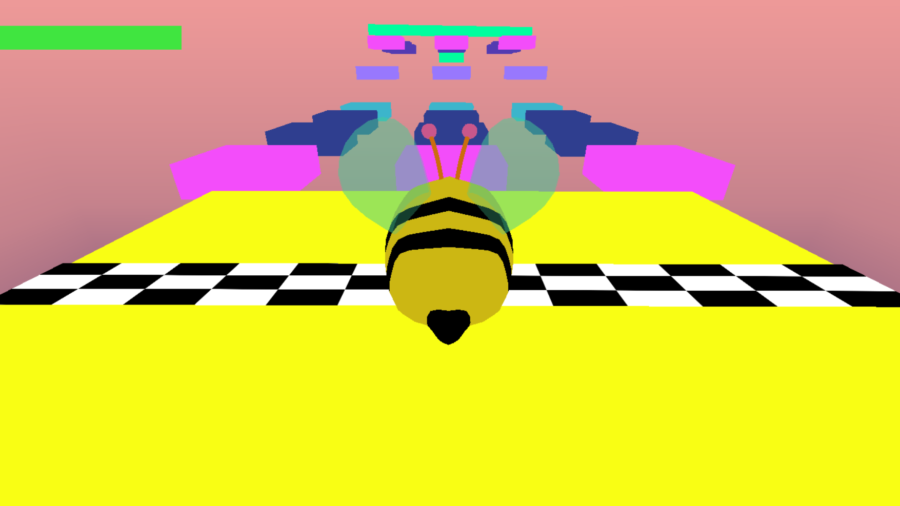
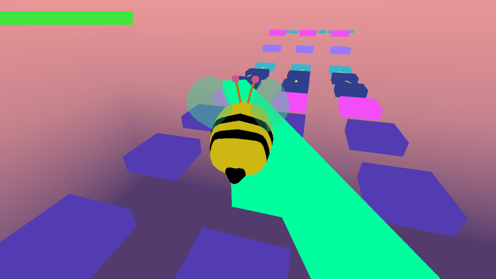
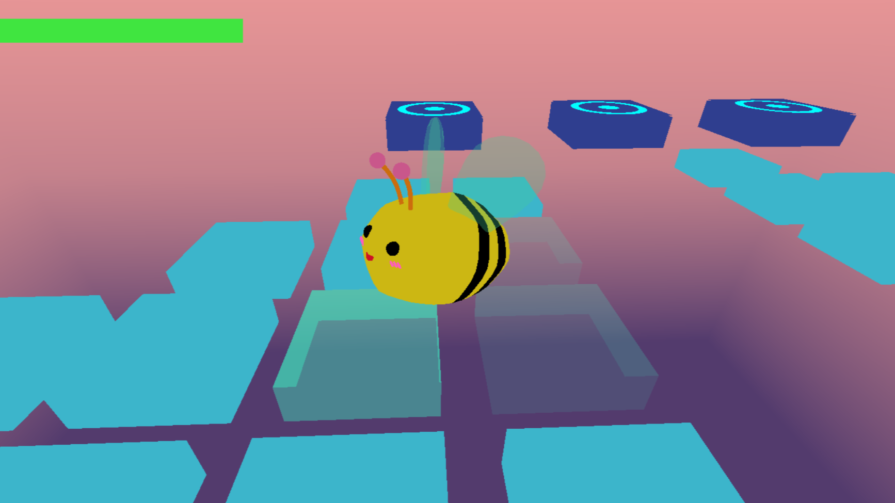
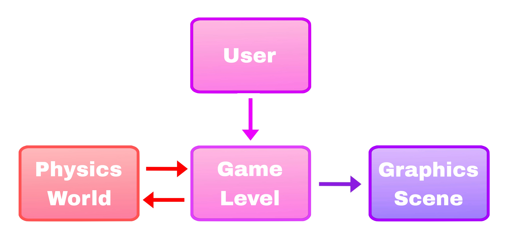

# The Bee's Adventure: Preview



## [Download and play!](https://github.com/naiderrp/simple-3d-platformer/tree/main/build3/exe)

---
## Design Overview

Simply put, the workflow can be represented as follows:



Game Level is responsible for synchronizing the graphics object with its associated physics body. Game Level passes the current state of game objects to the Physics World to update the simulation. Once it receives the new coordinates, Game Level forwards them to the Graphics Scene so the graphics renderer can redraw the objects.
In fact, the engine user interacts directly only with Game Level, adding game objects to the level design.

But if we dive deeper...

## Graphics Engine

The entire project is divided into two components: _GraphicsEngine_ and _GameEngine_.
GraphicsEngine is a dynamic library that manages the rendering of objects on the screen.
For external use, GraphicsEngine provides classes such as `Camera`, `Object3D`, `Object2D`, `SkyBox`, `ScreenText`, and `TimeStep`.

For example, `Object3D` can be initialized as an obj model. `Object3D` stores an instance of `TransformComponent` to allow modifying the underlying vertex mesh.
```
namespace GraphicsEngine {
    struct GRAPHICS_API TransformComponent {
        DirectX::XMFLOAT3 translation{0.0f, 0.0f, 0.0f };
        DirectX::XMFLOAT3 scale{ 1.f, 1.f, 1.f };
        DirectX::XMFLOAT3 rotation{};

        DirectX::XMMATRIX mat4();
    };

    class GRAPHICS_API Object3D
    {
    public:
        void InitializeAsBox(float width, float height, float depth, const DirectX::XMFLOAT4& color = { 0.0f, 1.0f, 1.0f, 1.0f });
        
        void InitializeAsSphere(D12Device& device, float radius, const DirectX::XMFLOAT4& color = { 0.0f, 1.0f, 1.0f, 1.0f });

        void InitializeAsObjModel(const char* objPath);

    public:
        TransformComponent transform = {};
	DirectX::XMFLOAT4 color = { 0.0f, 0.0f, 1.0f, 1.0f };     

    private:        
	VertexMesh mModel = {};
    };
}
```
Also, GraphicsEngine supports text rendering, both in world space and screen space coordinate systems.
```
namespace GraphicsEngine {
	class GRAPHICS_API ScreenText
	{
	public:		
		void InitializeFont(LPCWSTR fontFile, int windowWidth, int windowHeight);
	
		Render::Text::Font& Font();

		Render::Text::GraphicsContext GetGraphicsContext();
		
		void DrawInScreenSpace(bool on = true);

	public:
		std::wstring text = L"";
		LPCWSTR font = L"";

		TransformComponent textTransformComponent;
		
	private:
		Render::Text::Font mFont;
		const int mMaxNumTextCharacters = 1024;

		Render::Text::GraphicsContext mGraphicsContext;
	};
}
```
In addition to its core functionality, the timer also implements a countdown method:
```
namespace GraphicsEngine {
	namespace Timer {
		class GRAPHICS_API TimeStep
		{
		public:
			TimeStep();
			float Countdown(float startTime);
			float Tick();
			float GetElapsedTime() const;
			void Restart();
			void ResetCountdownTimer();
		private:
			std::chrono::steady_clock::time_point mLastTime;
			float mRemainingTime;
		};
	}
}
```
To interact with GraphicsEngine, it is necessary to create an instance of the `GraphicsScene` class.
``` 
namespace GraphicsEngine {
	class GRAPHICS_API GraphicsScene
	{
		using Object3D_ref = std::reference_wrapper<Object3D>;
		using Object2D_ref = std::reference_wrapper<Object2D>;
		using ScreenText_ref = std::reference_wrapper<ScreenText>;
	public:
		void addSceneObject(Object3D& object) { sceneObjects.emplace_back(object); }

		void addSceneObject2D(Object2D& object) { sceneObjects2D.emplace_back(object); }

		void addTextObject(ScreenText& text) { screenTexts.emplace_back(text); }

		void setCamera(Camera& cam) { camera = &cam; }
		void setSkybox(GraphicsEngine::SkyBox& sb) { skyBox = &sb; }
		
	public:
		std::vector<Object3D_ref> sceneObjects;
		std::vector<Object2D_ref> sceneObjects2D;

		std::vector<ScreenText_ref> screenTexts;

		SkyBox* skyBox = nullptr;
		Camera* camera = nullptr;
	};
}
```
GraphicsScene stores information about the objects that are being rendered each frame.
Currently, only one camera can be added to a scene.

## Game Engine

GameEngine is responsible for linking the graphical and physical representations of an object.
The graphics scene is managed by the `GameEngine::Level` class.
```
namespace GameEngine {
	class Level
	{

	// ...

	private:
		GraphicsEngine::GraphicsScene mGraphicsScene;
		GameEngine::PhysicsWorld mPhysicsWorld;
	};
} 
```
`GameEngine::PhysicsWorld` stores information about the physical world, i.e. about every physical object (body) in the game.
To simulate physics, the engine uses the _Bullet Physics_ library.
```
namespace GameEngine {
	class PhysicsWorld
	{
	public:
		enum PhysicsObjectType {
			eStatic,
			eDynamic,
			eKinematic
		};
	public:
		void addPhysicsObject(GameObject& obj, PhysicsObjectType type);

		void updateSimulation();
		
	private:
		std::unique_ptr<btDefaultCollisionConfiguration> mCollisionConfiguration = std::make_unique<btDefaultCollisionConfiguration>();
		std::unique_ptr<btCollisionDispatcher> mDispatcher = std::make_unique<btCollisionDispatcher>(mCollisionConfiguration.get());
		std::unique_ptr<btBroadphaseInterface> mOverlappingPairCache = std::make_unique<btDbvtBroadphase>();
		std::unique_ptr<btSequentialImpulseConstraintSolver> mSolver = std::make_unique<btSequentialImpulseConstraintSolver>();

		std::unique_ptr<btDiscreteDynamicsWorld> mDynamicsWorld = std::make_unique<btDiscreteDynamicsWorld>(mDispatcher.get(), mOverlappingPairCache.get(), mSolver.get(), mCollisionConfiguration.get());
		std::vector<std::unique_ptr<btCollisionShape>> mCollisionShapes;
		std::vector<std::unique_ptr<btMotionState>> mMotionStates;
	};
}
```
To add an object to the physical world, you need to pass a reference to an instance of the `GameEngine::GameObject` class.
An instance of the GameObject class represents an object in the game scene. Therefore, the class must synchronize changes to the graphical object with its physical representation. For example, when moving an object using the `setPos` method, the class must also update the coordinates of its physical body.
```
namespace GameEngine {
	class GameObject
	{
	public:
		struct BoundingBox {
			const float width = 0.0f;
			const float height = 0.0f;
			const float depth = 0.0f;
		};
	public:
		GameObject(float width, float height, float depth, const vec4_t& color)
			: mWidth(width), mHeight(height), mDepth(depth)
		{
			mGraphicsObject.InitializeAsBox(mWidth, mHeight, mDepth, color);
		}

		GameObject(const std::string& objPath, const BoundingBox& objModelBoundingBox)
			: mWidth(objModelBoundingBox.width), mHeight(objModelBoundingBox.height), mDepth(objModelBoundingBox.depth)
		{
			mGraphicsObject.InitializeAsObjModel(objPath.c_str());
		}

		GameObject(const GameObject&) = delete;
		GameObject(GameObject&&) = default;

		GameObject& operator=(const GameObject&) = delete;
		GameObject& operator=(GameObject&&) = default;
		
		~GameObject() = default;

	public:
		void update();

		void setPos(const vec3_t& position);

	public:
		std::unique_ptr<btRigidBody>& physicsBody() { return mPhysicsBody; }
		GraphicsEngine::Object3D& graphicsMesh() { return mGraphicsObject; }

		float width() const { return mWidth; }
		float height() const { return mHeight; }
		float depth() const { return mDepth; }

		vec4_t& color() { return mGraphicsObject.color(); }

		GraphicsEngine::TransformComponent& transform() { return mGraphicsObject.transform(); }

	private:
		GraphicsEngine::Object3D mGraphicsObject;
		std::unique_ptr<btRigidBody> mPhysicsBody;

		const float mWidth = 0.0f;
		const float mHeight = 0.0f;
		const float mDepth = 0.0f;
	};
}
```
`GameObject` is the main class for representing an object in the game. Based on this class, users can create their own game objects. For example, in the implemented platformer, the `GameObject` class served as the foundation for traps.
```
class StaticTrap {
public:
	StaticTrap(float width, float height, float depth, const vec4_t& color)
		: mPlatform(width, height, depth, color)
	{
	}

	void translate(const vec3_t& translation) {

		auto currentPos = mPlatform.transform().translation;		

		auto newPos = currentPos + translation;
		
		mPlatform.setPos(newPos);
	}

	GameEngine::GameObject& gameObject() { return mPlatform; }

private:
	GameEngine::GameObject mPlatform;
};

There is a structure called `Player` to describe the main character:

namespace GameEngine {
	struct Player {
		GameEngine::GameObject& character;
		GameEngine::CharacterMovementController& characterController;
		GraphicsEngine::Camera& camera;
	};
}
```
Essentially, this is just a wrapper for the `GameObject` class. It adds a camera that will follow a specific `GameObject` and the `GameEngine::CharacterMovementController` for movement control.
```
namespace GameEngine {
	class CharacterMovementController {
		
		enum KeyMappings {
			eTurnRight = 'D',
			eTurnLeft = 'A',
			eMoveForward = 'W',
			eMoveBackward = 'S',
			eJump = VK_SPACE
		};

	public:
		void update(float dt) {
			resetVelocity();

			if (GetAsyncKeyState(KeyMappings::eTurnLeft)) {
				processTurnLeft(dt);
			}
			if (GetAsyncKeyState(KeyMappings::eTurnRight)) {
				processTurnRight(dt);
			}

			if (GetAsyncKeyState(KeyMappings::eMoveForward)) {
				processMoveForward(dt);
			}

			if (GetAsyncKeyState(KeyMappings::eMoveBackward)) {
				processMoveBackward(dt);
			}

			if (GetAsyncKeyState(KeyMappings::eJump)) {
				processJump();
			}
		}

	private:
		bool isGrounded();

		void resetVelocity();

	private:
		void rotateCharacter(float rotate, float dt);

		void moveCharacter(float dt);

	private:
		void processTurnLeft(float dt);

		void processTurnRight(float dt);

		void processMoveForward(float dt);

		void processMoveBackward(float dt);

		void processJump();

	private:
		auto normalizeVector(const auto& vector);

		auto& getPosition(GraphicsEngine::Object3D& object);

	private:
		vec3_t mLinearVelocity = { 0.0, 0.0, 0.0 };

		const float mMoveSpeed = 50.0;
		const float mTurnSpeed = 7.0f;
		const double mJumpFactor = 8;
	};
}
```
You can also create your own game classes and integrate them into the engine. One such class is `HealthIndicator`:
```
namespace GameEngine {
	class HealthIndicator {
	public:
		HealthIndicator(uint32_t hitPoints, const vec4_t& color);

		void hit() {
			mIndicators.pop_back();
		}

		void reset() {
			mIndicators.clear();
			createIndicators(mHitPoints, mIndicatorsColor, 0.09, 0.09);
		}

		std::vector<GraphicsEngine::Object2D>& healthIndicators();
	
	private:
		void createIndicators(uint32_t hitPoints, const vec4_t& color, float indicatorWidth, float indicatorHeight);
	private:
		std::vector<GraphicsEngine::Object2D> mIndicators;
		const vec4_t mIndicatorsColor;
		const uint32_t mHitPoints;
	};
}
```
The main game class is `GameApplication`. This class manages the external logic of the application, controlling when the game starts, when it is paused, and when it ends.
In other words, the `GameApplication` class connects the Level with the graphics rendering process. To start the renderer, it is necessary to initialize the window where the rendering will take place.
The `Win32Application` class is also provided by the GraphicsEngine.
```
namespace GameEngine {
	class GameApplication
	{
	public:
		enum GameResult {
			eFailure,
			eSuccess
		};
	public:
		void initialize() {
			app.Initialize();
		}

		void renderScene() {
			auto dt = mTimer.Tick();
			
			mScene->update(dt);
			
			app.Update();
		}

		void setScene(GameEngine::Level& scene) {
			mScene = &scene;
			app.renderer.setScene(mScene->graphicsScene());
			mState = GameState::eRunning;
		}

		bool isRunning() { return app.isRunning(); }
		
		void gameOver(GameResult result) {
			if (mState != GameState::eRunning) return;
			
			switch (result) {
			case GameResult::eFailure:
				handleFailure();
				break;
			case GameResult::eSuccess:
				handleSuccess();
				break;
			}
			
			mState = GameState::eIdle;
		}

	private:
		void handleFailure();
		void handleSuccess();

	private:
		enum GameState {
			eRunning,
			eIdle
		};

	private:
		GraphicsEngine::Win32Application app;
		GameEngine::Level* mScene;

		GameState mState = GameState::eIdle;
	};
}
```

---

The outcome of the design is as follows:
```
int main() {
	GameEngine::GameApplication app;
	app.initialize();

	GameEngine::GameObject bee = { "models/bee.obj", GameEngine::GameObject::BoundingBox{1.5f, 1.5f, 1.5f} };

	std::vector<StaticTrap> staticTraps;
	for (int i = 0; i < 10; ++i) staticTraps.emplace_back(3.0, 1.0, 3.0, GameEngine::Colors::TURQUOISE);

	GraphicsEngine::SkyBox skybox = {};
	skybox.InitializeAsSphere(0.5f);
	skybox.texturePath = L"textures\\skybox\\gradient_skybox.dds";

	GraphicsEngine::Camera thirdPersonCamera;
	GameEngine::CharacterMovementController beeController = {bee, thirdPersonCamera };
	GameEngine::HealthIndicator beeHealth = { 5, GameEngine::Colors::LIME_GREEN };

	GameEngine::Player player = { bee, beeController, beeHealth, thirdPersonCamera};

	GameEngine::Level mainScene = {};

	mainScene.setSkyBox(skybox);

	for (auto& trap : staticTraps) mainScene.addStaticTrap(trap);

	mainScene.setPlayer(player);

	app.setScene(mainScene);

	while (app.isRunning()) {

		app.renderScene();

		if (beeHealth.healthIndicators().empty())
		{
			app.gameOver(GameEngine::GameApplication::GameResult::eFailure);
		}
		else if (mainScene.isVictory())
		{
			app.gameOver(GameEngine::GameApplication::GameResult::eSuccess);
		}
	}

	return 0;
}
```

---

###### I'm just learning about application design. If you notice any mistakes, please feel free to contact me. Thank you in advance!
